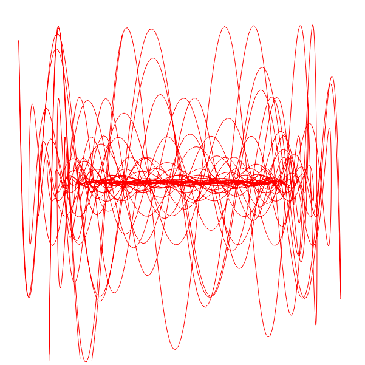

# harmonograph
Mathematica's "Manipulate[]" as a golang server and mithril website. 

1. Install go
2. run `go get https://github.com/liudng/dogo`
3. run `go get github.com/libliflin/harmonograph`
4. on windows: `cd %GOPATH%`
5. on not windows: `cd $GOPATH`
6. run `cd src/github.com/libliflin/harmonograph`
7. run `dogo`
8. Open your browser to localhost:8080/harmonograph

